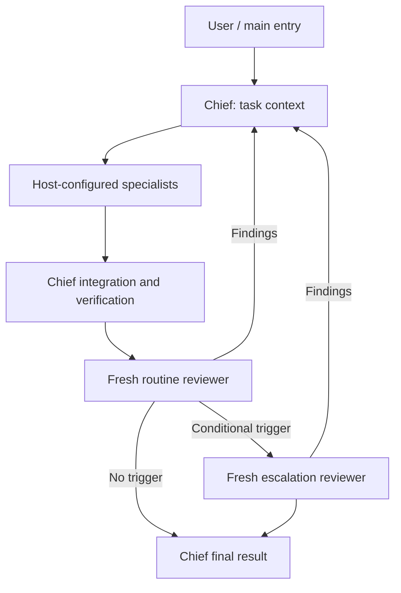

# Development Agents

Custom development agents for [Claude Code](https://code.claude.com/docs/en/sub-agents), [Codex](https://developers.openai.com/codex/), [Cursor](https://cursor.com/docs/subagents), and [OpenCode](https://opencode.ai/docs/agents/). The same roster is provided in each tool's native format: Markdown for Claude Code, Cursor, and OpenCode, and TOML for Codex.

## Install

Claude Code:

```bash
./install.sh
```

Codex:

```bash
./install-codex.sh
```

Cursor:

```bash
./install-cursor.sh
```

OpenCode:

```bash
./install-opencode.sh
```

The Claude Code, Cursor, and OpenCode installers use symlinks, so **editing an existing agent file in this repo takes effect immediately** in new sessions. Re-run those installers after adding, renaming, or deleting an agent.

Claude sources live in [`agents/`](./agents) and are linked into `~/.claude/agents`. Cursor sources live in [`cursor-agents/`](./cursor-agents) and are linked into `~/.cursor/agents`. OpenCode sources live in [`opencode-agents/`](./opencode-agents) and are linked into `~/.config/opencode/agents` (or `$XDG_CONFIG_HOME/opencode/agents`).

Codex sources live in [`codex-agents/`](./codex-agents), but `./install-codex.sh` copies them into `$CODEX_HOME/agents` (default: `~/.codex/agents`) because Codex 0.149.0 does not discover symlinked agent files. **Re-run the Codex installer after every edit, addition, rename, or deletion.** The installer tracks only the copies it creates, migrates symlinks created by older versions of this installer, and skips unrelated files or symlinks by default. Run `./install-codex.sh --overwrite` to replace conflicting agent files or symlinks with repository copies and adopt them into the management manifest. This replaces local customizations for matching agent names; directories (including symlinks to directories) are always skipped.

OpenCode runs `chief` as the persistent **primary** Sol agent: Tab to it as the session harness. For Claude Code, start `claude --agent chief` to use the Sonnet chief as the main session. On Codex and Cursor, delegate the task to `chief`; the host main thread remains separate. Nested delegation depends on host tool access and depth limits. See [Host limits](#host-limits).

## The roster

| Agent | Job | Touches code? |
|---|---|---|
| [chief](agents/chief.md) | Orchestrates the roster for multi-step work; returns one synthesized report | No — coordinates + verifies |
| [implementer](agents/implementer.md) | Implements a clear requirement or architecture plan within an assigned file scope | Yes |
| [code-reviewer](agents/code-reviewer.md) | Fresh independent routine review of the final change | No — reports only |
| [escalation-reviewer](agents/escalation-reviewer.md) | Fresh escalation review for high-risk, uncertain, disputed, or explicitly highest-quality work | No — reports only |
| [debugger](agents/debugger.md) | Reproduces bugs, finds root cause with evidence, applies minimal fix | Yes |
| [test-writer](agents/test-writer.md) | Writes behavior-focused tests in the project's existing framework, runs them | Yes |
| [docs-writer](agents/docs-writer.md) | READMEs, API docs, runbooks — grounded in the actual code | Docs only |
| [security-auditor](agents/security-auditor.md) | Defensive vulnerability audit with severity + remediation | No — reports only |
| [architect](agents/architect.md) | Designs features before coding: approaches, trade-offs, step-by-step plan | No — plan is the deliverable |

Codex additionally includes [explorer](codex-agents/explorer.toml) for repository reconnaissance, [mechanical-worker](codex-agents/mechanical-worker.toml) for low-judgment repetitive edits, and [critical-architect](codex-agents/critical-architect.toml) for rare consequential cross-system decisions on Sol. Its [test-writer](codex-agents/test-writer.toml) also acts as an independent coverage reviewer and risk-based test designer.

For Codex, the roster is grouped by intended frequency:

- **Core delivery:** `chief`, `explorer`, `architect`, `implementer`, `debugger`, `test-writer`, `code-reviewer`
- **Conditional specialists:** `mechanical-worker`, `security-auditor`
- **Documentation specialist:** `docs-writer`
- **Rare design specialist:** `critical-architect`
- **Conditional review escalation:** `escalation-reviewer`

| Codex agent | Model | Reasoning |
|---|---|---|
| `chief` | `gpt-5.6-sol` | Medium |
| `explorer` | `gpt-5.6-terra` | Low |
| `architect` | `gpt-5.6-sol` | High |
| `implementer` | `gpt-5.6-terra` | Medium |
| `debugger` | `gpt-5.6-terra` | Medium |
| `test-writer` | `gpt-5.6-terra` | Medium |
| `code-reviewer` | `gpt-5.6-sol` | High |
| `mechanical-worker` | `gpt-5.6-luna` | Low |
| `security-auditor` | `gpt-5.6-sol` | High |
| `docs-writer` | `gpt-5.6-terra` | Medium |
| `critical-architect` | `gpt-5.6-sol` | High |
| `escalation-reviewer` | `gpt-6-astra` | Medium |

The read-only split is deliberate: reviewers and auditors that can't edit can't "helpfully" change the thing they're judging.

## How invocation works

See [Example agent prompts](PROMPTS.md) for copy-ready briefs covering individual specialists, critical architecture, and full-team workflows.

Invocation differs slightly by host:

1. **Claude Code and Cursor can delegate automatically.** Their parent agents use the task, current context, and each custom agent's `description` to choose a specialist. Specific descriptions and phrases such as "use proactively" make matching more reliable.
2. **Ask Codex to delegate.** Current local Codex releases launch subagents after a direct request or an applicable `AGENTS.md` or skill instruction. A custom agent's `description` guides role selection once delegation is in scope; it does not by itself guarantee proactive delegation.
3. **OpenCode uses `chief` as the primary session agent.** Tab to `chief`, then it delegates to specialist subagents from their `description`. You can also `@mention` a specialist directly, for example `@debugger investigate this failing test`.
4. **Name an agent for deterministic routing:**
   > Use the **security-auditor** subagent on the upload endpoint.
   > Have the **architect** subagent plan the invoice-numbering change before we touch code.

   Cursor also supports slash invocation, such as `/debugger investigate this failing test`.

Each subagent runs in its **own context window**. Give it a self-contained brief; a huge debugging session then stays out of the main context.

## Delivery and review routing

The chief owns the task context, derives acceptance criteria, classifies risk, plans, and gives bounded work to the cheapest capable specialists. Routine Codex implementation and debugging use Terra; exploration, tests, and docs use Terra; mechanical edits use Luna. OpenCode uses its configured local model for implementation, debugging, tests, docs, and local exploration. Use the host’s configured architecture or security specialists when the work calls for them. Claude uses Sonnet for chief and routine review, Opus for escalation, and inherited models for other specialists. Cursor inherits the session model for all roles. Workers inspect only relevant context, stay inside assigned writable scopes, do not spawn agents, and return changed files, decisions, exact checks, and uncertainty.

After implementation, the chief inspects the final diff and source itself, checks worker claims against direct evidence, and runs or coordinates appropriate build, tests, lint, static analysis, and repository-specific checks. It then sends a **fresh** `code-reviewer` the [review packet](REVIEW_PACKET.md), final diff including relevant untracked files, relevant sources, and repository instructions. The reviewer checks requirements, correctness, edge cases, test coverage, conventions, maintainability, visible security issues, and scope drift. Reviewers remain read-only; fixes go to a writable specialist. Do not forward full worker transcripts or unrelated exploration logs.

The routing policy is shared; model selection is host-specific:

| Host | Chief / routine reviewer | Escalation reviewer |
|---|---|---|
| Claude Code | `sonnet` | `opus` |
| Codex | `gpt-5.6-sol` | `gpt-6-astra` |
| Cursor | `inherit` | `inherit` (independent review, no automatic model upgrade) |
| OpenCode | `openai/gpt-5.6-sol` | `openai/gpt-6-astra` |

| Risk | Route |
|---|---|
| Low | Workers → chief verification → routine reviewer |
| Medium | Workers → chief verification → routine reviewer; escalation review only for unresolved uncertainty or disagreement |
| High | Workers → chief verification → routine reviewer → escalation reviewer |
| Explicit highest-quality review | Include escalation reviewer after routine review |

Risk is based on impact and uncertainty, not simply the number of files. Treat an applicable escalation trigger as high for routing, even if the initial classification was lower. Invoke `escalation-reviewer` for authentication, authorization, secrets, cryptography, or sensitive data; destructive data operations or database migrations; concurrency, distributed workflows, or difficult state transitions; public API or backward-compatibility changes; major architecture changes; a large or unusually cross-cutting diff; failed or unavailable verification; meaningful unresolved uncertainty; disagreement between chief and routine reviewer; or an explicit request for highest-quality review. A high-risk classification requires escalation review. File changes alone do not trigger it. The chief addresses findings, reruns affected checks, and stops after two unsuccessful review/fix cycles with a clear blocker or disagreement.



A normal low-risk feature runs through implementation, verification, and routine review without invoking escalation review. For a reproducible failure, use the debugger; for a real design choice, use the architect. A focused security audit can supplement the review on relevant changes. The chief should not start extra specialists merely to fill a roster.

### Host limits

OpenCode defines `chief` with native `mode: primary`. Claude Code can run the definition as its main session via `claude --agent chief`; when delegated instead, the chief needs Agent access and sufficient nesting depth. See [Claude Code subagents](https://code.claude.com/docs/en/sub-agents).

Codex pins its chief subagent to Sol; role files do not select the parent session model. Delegation must be authorized and permitted by the session. See [Codex subagents](https://learn.chatgpt.com/docs/agent-configuration/subagents).

Cursor uses `model: inherit`, so escalation adds an independent review without promising a different model. Use a model supported by your Cursor installation if configuring an explicit override. Nested dispatch needs Task access and available depth; see [Cursor subagents](https://cursor.com/docs/subagents).

If a chief cannot dispatch, it returns actionable briefs and pending review gates to its parent rather than claiming the workflow completed. Host settings can override model choices or permissions; report unavailable review gates. The role files do not enforce routing automatically.

### Overlap with built-ins

Claude Code ships built-in capabilities that overlap: `/code-review` (diff review), `/security-review`, the Plan/Explore agents, and (if installed) the superpowers plugin's process skills. Cursor also includes built-in Explore, Bash, and Browser subagents. OpenCode ships built-in Build, Plan, General, Explore, and Scout agents. The custom agents differ in being **yours** — tune a prompt when a review misses something you care about, add stack-specific rules (e.g. .NET or Docker checks), and the change applies everywhere. Use whichever fits; they don't conflict.

## Anatomy of an agent

Claude Code agents are Markdown files with YAML frontmatter:

```markdown
---
name: kebab-case-id
description: What it does + WHEN to use it. This is what triggers
  automatic delegation — write it like a matching rule, not a slogan.
tools: Read, Grep, Glob, Bash        # omit to inherit all tools
permissionMode: plan                 # read-only exploration by default
---

The role's system prompt. A subagent does not inherit the full parent
conversation, so make the delegated task self-contained. Project instructions
and environment context may also be loaded by the host.
```

Tips learned the hard way:

- **`description` is routing metadata.** Make it a concrete matching rule with positive and negative scope. Claude Code, Cursor, and OpenCode use it for automatic delegation; Codex uses it as role guidance when spawning.
- **Restrict permissions and tools.** Claude read-only roles use `permissionMode: plan`; Codex uses `sandbox_mode = "read-only"`; Cursor uses `readonly: true`; OpenCode uses a V2 `permissions` array of `action` / `resource` / `effect` rules (`edit` deny, `subagent` deny, `git push *` denials). Tool allowlists narrow each role further. A more-permissive live parent/session override can take precedence in some hosts, so keep the prompt-level no-edit rule too.
- **Define ownership and evidence.** Writable roles need a file boundary and preservation rule; reviewers need a reproducible failure scenario and validation gaps.
- **Use a stable output contract.** This makes handoffs and final synthesis reliable.
- **Keep prompts focused.** Add a prohibition only when it prevents a concrete failure mode; duplicated or generic instructions dilute the role.

Codex agents are TOML role files:

```toml
name = "code-reviewer"
description = "What it does and when Codex should use it."
model = "gpt-5.6-sol"
model_reasoning_effort = "high"
sandbox_mode = "read-only"

developer_instructions = '''
The agent's complete role prompt, process, rules, and output format.
'''
```

Codex uses `sandbox_mode = "read-only"` for reviewers, planners, and the chief, and `workspace-write` for agents that implement changes. Claude uses `permissionMode: plan` for the same read-only roles and explicitly resets writable roles to `permissionMode: default`, so a writable child does not inherit the chief's plan mode. The chief dispatches the explicitly writable `implementer` instead of relying on an inherited general-purpose role. Tool allowlists do not map one-to-one between the hosts, so each definition combines native permission enforcement with explicit role instructions.

Cursor agents are Markdown files with YAML frontmatter too, but permissions are expressed directly:

```markdown
---
name: code-reviewer
description: What it does and when Cursor should delegate to it.
model: inherit
readonly: true
---

The subagent's complete prompt.
```

Use `readonly: true` for reviewers and planners, and `readonly: false` for agents that edit code or documentation. Cursor supports project-local agents in `.cursor/agents/`; this repo installs the same definitions globally in `~/.cursor/agents/`.

OpenCode agents are Markdown files with YAML frontmatter. The filename (minus `.md`) is the agent id. The V2 `permissions` array uses ordered `{action, resource, effect}` rules (last match wins). The installed OpenCode 1.18.23 uses the mirrored V1 `permission` map instead, so keep both equivalent until upgrading. `mode` is `primary` for the session harness and `subagent` for specialists:

```markdown
---
description: What it does and when OpenCode should use it.
mode: subagent
model: ollama/qwen3-coder:30b
permissions:
  - action: edit
    resource: "*"
    effect: allow
  - action: shell
    resource: "*"
    effect: allow
  - action: shell
    resource: "git push"
    effect: deny
  - action: shell
    resource: "git push *"
    effect: deny
  - action: subagent
    resource: "*"
    effect: deny
permission:                    # OpenCode 1.x mirror
  edit: allow
  bash:
    "*": allow
    "git push": deny
    "git push *": deny
  task: deny
---

The agent's complete role prompt.
```

Use `mode: primary` only for `chief`. Specialists stay `mode: subagent` so they cannot become a competing session harness. Keep V2 `permissions` and the V1 `permission` mirror synchronized. The installed 1.18.23 runtime reads the V1 mirror; a V2 runtime reads the V2 rules. Do not rely on prompt-only restrictions for read-only agents. Avoid the deprecated `tools` boolean map. This repo installs OpenCode definitions globally in `~/.config/opencode/agents/`; OpenCode also discovers project-local files in `.opencode/agents/`.

## OpenCode

OpenCode is intended as the main agent harness for a hybrid cloud/local setup. The behavioral prompts match the rest of the roster; the OpenCode port adds per-agent model routing and least-privilege permissions.

```
User
  │
  ▼
chief / Sol primary model
  │
  ├── architect / Sol
  ├── local-explorer / local
  ├── implementer / local
  ├── debugger / local
  ├── test-writer / local
  ├── docs-writer / local
  ├── code-reviewer / Sol
  ├── escalation-reviewer / Astra (conditional)
  └── security-auditor / Sol
```

The intent is to use **local compute** for high-volume repository reading, implementation, tests, and debugging, and **Sol** for orchestration, architecture, and routine review, with Astra reserved for triggered escalation.

| Agent | Mode | Model | Edits? |
|---|---|---|---|
| [chief](opencode-agents/chief.md) | primary | `openai/gpt-5.6-sol` | No — coordinates + verifies |
| [architect](opencode-agents/architect.md) | subagent | `openai/gpt-5.6-sol` | No — plan only |
| [implementer](opencode-agents/implementer.md) | subagent | `ollama/qwen3-coder:30b` | Yes |
| [debugger](opencode-agents/debugger.md) | subagent | `ollama/qwen3-coder:30b` | Yes |
| [test-writer](opencode-agents/test-writer.md) | subagent | `ollama/qwen3-coder:30b` | Tests only |
| [docs-writer](opencode-agents/docs-writer.md) | subagent | `ollama/qwen3-coder:30b` | Docs only |
| [code-reviewer](opencode-agents/code-reviewer.md) | subagent | `openai/gpt-5.6-sol` | No — reports only |
| [escalation-reviewer](opencode-agents/escalation-reviewer.md) | subagent | `openai/gpt-6-astra` | No — reports only |
| [local-explorer](opencode-agents/local-explorer.md) | subagent | `ollama/qwen3-coder:30b` | No — reports only |
| [security-auditor](opencode-agents/security-auditor.md) | subagent | `openai/gpt-5.6-sol` | No — reports only |

Install:

```bash
./install-opencode.sh
```

That symlinks [`opencode-agents/*.md`](./opencode-agents) into `~/.config/opencode/agents/` (or `$XDG_CONFIG_HOME/opencode/agents` if set). The installer is idempotent, will not overwrite a real (non-symlink) file, and only removes dangling symlinks that pointed back into this repository.

### Models and providers

This repo does **not** ship API keys or an `opencode.json`. Configure providers in OpenCode as you normally would. A malformed host config prevents native agent loading even when these files parse; validate with `opencode agent list`:

- **Frontier models** `openai/gpt-5.6-sol` and `openai/gpt-6-astra` require your usual OpenCode OpenAI (or compatible) provider configuration. The Astra reviewer runs only when routed by the chief. Change `model:` if your provider exposes a different id.
- **Local model** `ollama/qwen3-coder:30b` expects [Ollama](https://ollama.com) at the normal local endpoint (`http://localhost:11434`). Pull and serve `qwen3-coder:30b` before using the local roles.

OpenCode also ships a built-in read-only `explore` subagent. Use `local-explorer` when local-model reconnaissance is appropriate; the built-in remains available.

## Adding a new agent

1. Create `agents/<name>.md`, `codex-agents/<name>.toml`, `cursor-agents/<name>.md`, and `opencode-agents/<name>.md` in the native formats above.
2. Run `./install.sh`, `./install-codex.sh`, `./install-cursor.sh`, and `./install-opencode.sh`.
   Re-run `./install-codex.sh` after every later edit to the Codex TOML file because Codex agents are copied rather than symlinked.
3. Test it explicitly in each tool: "Use the <name> subagent to …" (on OpenCode, Tab to `chief` or `@name`) and iterate on the prompts until the output is right.
4. Commit all four definitions together.

Ideas for later: a `refactorer` (behavior-preserving cleanup), a `dotnet-specialist` or `docker-specialist` with stack-specific checklists, a `pr-describer` that writes PR descriptions from diffs.
